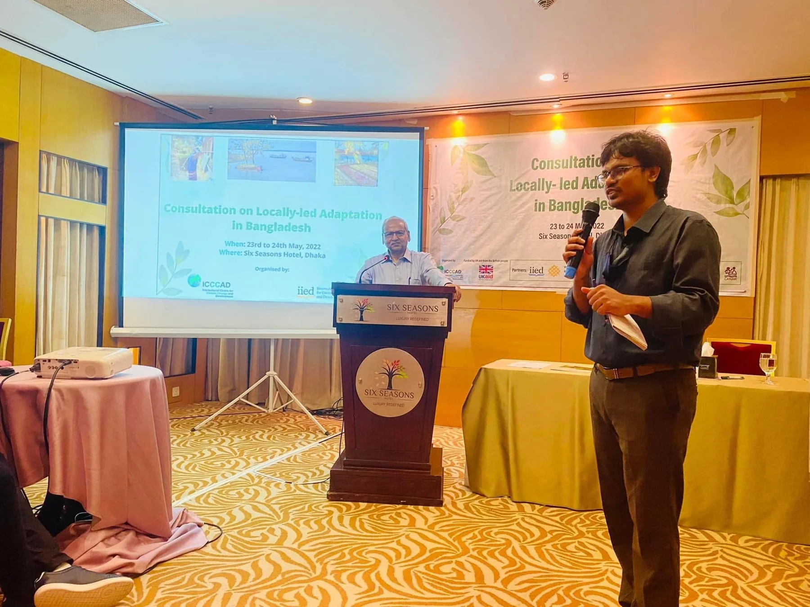
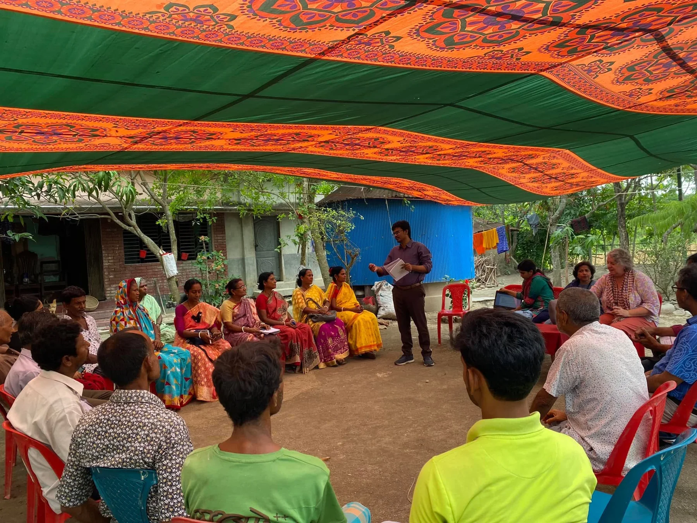
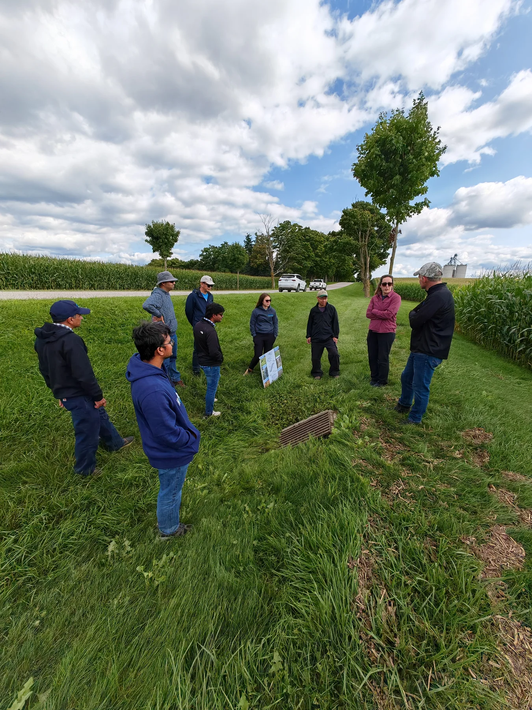

My professional experience spans academia, watershed management, international development, consulting, and organisational leadership. Across these settings, I connect environmental evidence with practical decisions.

## Career at a glance

<article class="research-card">
Academic & research
<h3>2022–present</h3>
University of Guelph · Doctoral research and teaching → Postdoctoral Scholar, September 2026
</article><article class="research-card">
Watershed & conservation
<h3>2024</h3>
Ausable Bayfield Conservation Authority · Water-quality analysis and monitoring strategy
</article><article class="research-card">
NGO & international development
<h3>2016–2022</h3>
ICCCAD and BRAC · Adaptation research, implementation, and partnerships
</article><article class="research-card">
Consulting & leadership
<h3>2016–2022</h3>
IUCN, Ispahani Agro, and CARE · Spatial analysis, agriculture, and proposal development
</article>

## Roles and contributions

<article class="timeline-card">
September 2026–present
<h2>Postdoctoral Scholar</h2>
<a href="https://geg.uoguelph.ca/">University of Guelph</a>

Developing a research program on resilient agricultural landscapes and sustainable food production, with growing directions in Earth observation, GeoAI, and environmental decision support.
</article>
<article class="timeline-card">
September 2022–August 2026
<h2>Doctoral research and teaching</h2>
<a href="https://geg.uoguelph.ca/">University of Guelph</a>

PhD research in precision conservation, agricultural water quality, geospatial analysis, machine learning, and process-based modelling. Graduate Research Assistant, May 2024–August 2026; Graduate Teaching Assistant, September 2022–April 2024.
</article>
<article class="timeline-card">
June–August 2024
<h2>Data Analyst</h2>
<a href="https://www.abca.ca/">Ausable Bayfield Conservation Authority</a>

Analysed long-term water-quality data using statistical and machine-learning approaches, supporting watershed interpretation and monitoring and quality-assurance planning.
</article>
<article class="timeline-card">
August–November 2022
<h2>Consultant · Project Proposal Writer</h2>
<a href="https://www.carebangladesh.org/">CARE Bangladesh</a>

Co-developed climate-resilience and ecosystem-based adaptation proposals with multidisciplinary teams.
</article>
<article class="timeline-card">
January–August 2022
<h2>Operation and Business Development Manager</h2>
<a href="https://www.icccad.net/">ICCCAD, Independent University, Bangladesh</a>

Coordinated a research portfolio and the Locally Led Adaptation Program, including partnerships, resource mobilisation, capacity development, and research communication.
</article>
<article class="timeline-card">
March–August 2022
<h2>Consultant</h2>
<a href="https://ispahaniagroltd.com/">Ispahani Agro Limited</a>

Research and assessments on climate-resilient seeds, bio-pesticides, sustainable agricultural investment, ESG, financial inclusion, and smallholder digital services.
</article>
<article class="timeline-card">
April 2018–January 2022
<h2>Manager, Climate Resilience and Development</h2>
<a href="https://www.brac.net/">BRAC Climate Change Program</a>

Led project development, climate-adaptation implementation, environmental and social safeguards, and climate-smart agriculture initiatives. Built partnerships and contributed to institutional climate-resilience frameworks.
</article>
<article class="timeline-card">
October 2016–March 2018
<h2>Research Officer</h2>
<a href="https://www.icccad.net/">ICCCAD</a>

Climate-adaptation and resilience research, GIS analysis, policy research, technical writing, proposal development, and capacity building.
</article>
<article class="timeline-card">
October–December 2016
<h2>Junior Consultant</h2>
<a href="https://iucn.org/our-work/region/asia/countries/bangladesh">IUCN, Bangladesh</a>

GIS analysis and mapping for wildlife conservation planning and Vulture Safe Zone initiatives.
</article>

## Teaching and mentoring

At the University of Guelph, I supported laboratories, seminars, student consultations, assessment, and hands-on GIS instruction across five undergraduate courses.

<ul class="course-grid"><li><strong>GEOG*1350</strong>Earth: Hazards and Global Change</li><li><strong>GEOG*2000</strong>Geomorphology</li><li><strong>GEOG*3000</strong>Fluvial Processes</li><li><strong>GEOG*2480</strong>Mapping and GIS</li><li><strong>GEOG*3480</strong>GIS and Spatial Analysis</li></ul>

<figure class="feedback-card"><blockquote>“Excellent TA who was able to handle all technical issues and problems thrown his way”</blockquote><figcaption>Selected anonymous student feedback · GEOG*3480 GIS and Spatial Analysis · Winter 2024</figcaption></figure>
<figure class="feedback-card"><blockquote>“Zion gave very helpful and detailed feedback on the labs. More so than a TA has ever given me for work. Helps you improve.”</blockquote><figcaption>Selected anonymous student feedback · GEOG*3480 GIS and Spatial Analysis · Winter 2024</figcaption></figure>

## Leadership and science–policy practice

My work at BRAC and ICCCAD included team coordination, proposal development, resource mobilisation, partnerships, and knowledge translation. These experiences inform how I connect research with implementation.

<figure class="evidence-photo"><figcaption>Science–policy dialogue: consultation on locally led adaptation in Bangladesh.</figcaption></figure><figure class="evidence-photo"><figcaption>Learning from community experience and local adaptation priorities.</figcaption></figure>

<figure class="evidence-photo"><figcaption>Collaborative fieldwork: grounding environmental questions in agricultural landscapes.</figcaption></figure>

[View the full academic CV →](cv.qmd)
