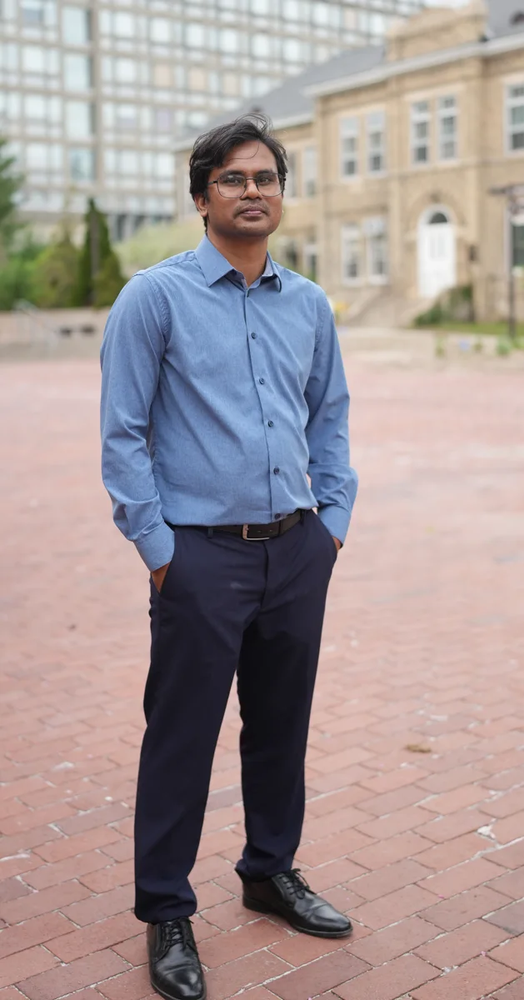

Environmental science · Geography · Decision science

<h1>Md Bodrud-Doza</h1>

PhD in Geography · Postdoctoral Scholar

<a href="https://geg.uoguelph.ca/">Department of Geography, Environment and Geomatics</a> <a href="https://www.uoguelph.ca/">University of Guelph</a>, Canada

I study how agricultural landscapes can sustain food production while protecting water, soil, and ecosystems.

I bring together geospatial analysis, environmental monitoring, machine learning, and process-based modelling to understand environmental risks and support better landscape-management decisions.

<a class="button primary" href="research.qmd">Explore Research Lab</a><a class="button secondary" href="publications.qmd">Publications</a><a class="text-link" href="assets/Md_Bodrud_Doza_Academic_CV.pdf">Download CV ↗</a>

<figure class="hero-photo"><figcaption>University of Guelph · Ontario, Canada</figcaption></figure>

Research theme
<h2>Resilient Agricultural Landscapes and Sustainable Food Production</h2>
From understanding spatial risk to evaluating interventions and building practical decision tools.

<dl class="summary-strip">
<dt>What I study</dt><dd>Agricultural landscapes · Water quality · Food-system resilience</dd>

<dt>How I work</dt><dd>Monitoring · Geospatial analysis · Machine learning · Modelling</dd>

<dt>Why it matters</dt><dd>Better targeting · Resilient landscapes · Informed decisions</dd>
</dl>

## Current research directions

<a href="research.qmd"><strong>REAL Decision Lab</strong></a> · Developing research program

<article class="research-card">
Established foundation
<h3>Precision & multifunctional conservation</h3>
Target conservation where it can deliver water-quality and wider landscape benefits.
</article><article class="research-card">
Emerging methods
<h3>Earth observation & GeoAI</h3>
Use Earth observation and GeoAI (AI for geographic data) to understand agricultural and environmental change.
</article><article class="research-card">
Developing direction
<h3>Food-system resilience</h3>
Explore how early stress signals and capacities to absorb shocks can inform timely adaptation.
</article>

## Updates



## Selected publications



[Explore the complete publication record →](publications.qmd)

<h2>Let’s connect research with practice.</h2>
I welcome research collaborations, grant development, graduate student research, and applied environmental initiatives.
<a class="button primary" href="collaboration.qmd">Collaboration interests</a><a class="text-link" href="experience.qmd#teaching-and-mentoring">Teaching and mentoring →</a><a class="text-link" href="https://scholar.google.com/citations?user=1VymNoIAAAAJ&amp;hl=en">Google Scholar ↗</a>

