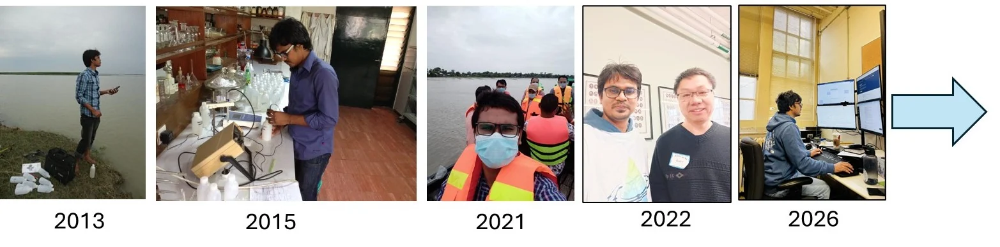

My research has developed through three overlapping emphases. Each adds methods and perspective to the work that came before.

<figure class="evidence-photo journey-image"><figcaption>2013–2026 · From water sampling and laboratory analysis to applied fieldwork and computational research.</figcaption></figure>

## A connected research trajectory

<article>
01 · Measure & map
<h3>Environmental quality, water resources & spatial risk</h3>
Groundwater and water quality → GIS and geostatistics → understanding spatial environmental risk.

Measurement &amp; mapping
</article><article>
02 · Adapt & connect
<h3>Climate adaptation, resilience & science–policy</h3>
Climate adaptation → community and institutional practice → connecting evidence with implementation.

Measurement &amp; mapping + adaptation practice
</article><article>
03 · Predict & decide
<h3>Precision conservation & resilient agricultural landscapes</h3>
Watershed monitoring and modelling → machine learning → conservation planning → adaptive decision support.

Measurement &amp; mapping + adaptation practice + modelling
</article>

<strong>Common thread:</strong> environmental evidence → spatial understanding → better decisions.

2026 onward → Developing research program
<h2>REAL Decision Lab</h2>
Resilient agricultural landscapes and sustainable food production.
<a href="research.qmd">Explore Research Lab →</a>

