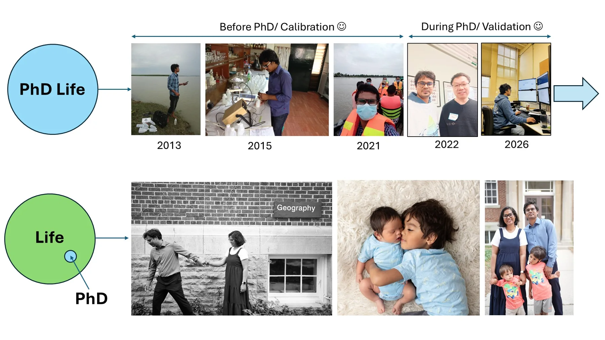

Environmental data and spatial analysis connect three overlapping phases of my career. Fieldwork, institutional practice, and computational research each inform the program I am developing today.

<figure class="evidence-photo"><figcaption>Research and family, 2013–2026: a personal collage shared to show the wider journey. Research milestones are described in accessible text below.</figcaption></figure>

## Milestones at a glance

<ol class="milestone-grid">
<li><strong>2013</strong>Water sampling and early spatial environmental research<small>Water quality · GIS</small></li>
<li><strong>2015</strong>Laboratory analysis and environmental quality<small>Hydrogeochemistry · Risk assessment</small></li>
<li><strong>2021</strong>Climate adaptation and applied field engagement<small>Resilience · Science–policy</small></li>
<li><strong>2022</strong>Beginning doctoral research at Guelph<small>Precision conservation · Watersheds</small></li>
<li><strong>2026</strong>Modelling, validation, and the postdoctoral transition<small>Machine learning · Decision support</small></li>
</ol>

## Three overlapping phases

01 · Measure & map Environmental quality, water resources, and spatial analysis

Early work focused on groundwater quality, hydrogeochemistry, contamination, human-health risk, GIS, geostatistics, and spatial patterns of environmental vulnerability.

Water quality · Groundwater · GIS · Environmental risk

02 · Adapt & implement Climate adaptation, resilience, and science–policy practice

Research and professional practice expanded toward climate adaptation, climate-smart agriculture, ecosystem-based adaptation, climate finance, and the institutional conditions that help evidence lead to action.

Climate resilience · Implementation · Institutions · Science–policy

03 · Predict & decide Precision conservation and resilient agricultural landscapes

Doctoral and postdoctoral work brings these experiences together around agricultural water quality, conservation prioritization, modelling, monitoring, and adaptive decision support. Earth observation and GeoAI are growing directions.

Precision conservation · Modelling · Machine learning · Adaptive decisions

2026 onward → Developing research program
<h2>REAL Decision Lab</h2>
Resilient agricultural landscapes and sustainable food production.
<a href="research.qmd">See how the research strands connect →</a>

