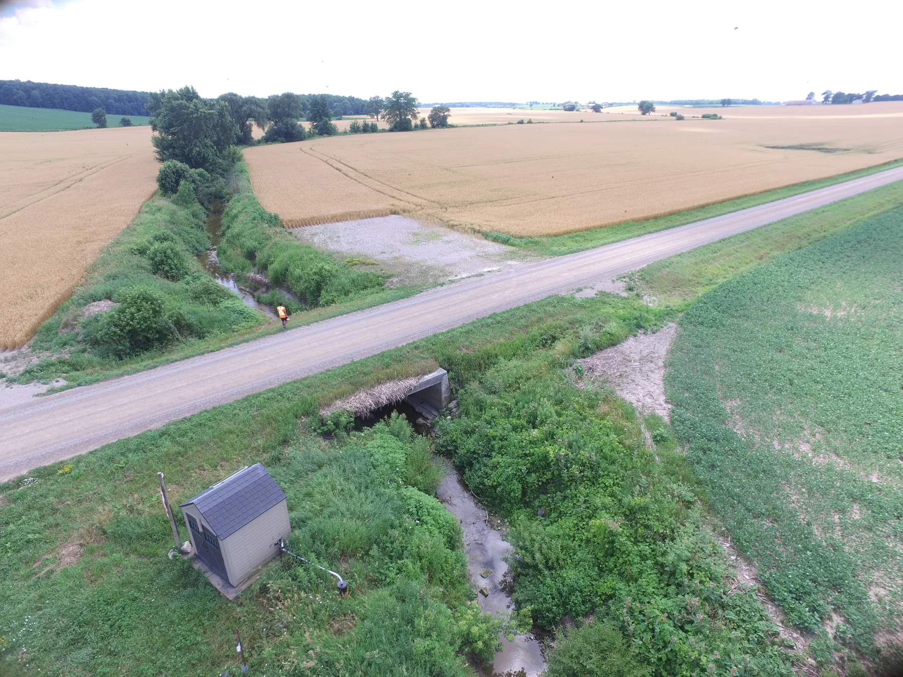
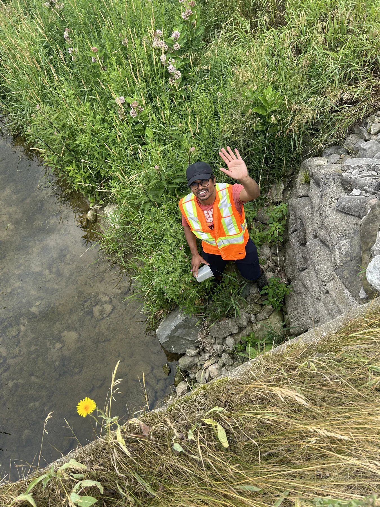

Developing research program

## REAL Decision Lab

**Resilient Agricultural Landscapes Decision Lab**

Building evidence and decision tools for resilient agricultural landscapes and sustainable food production. The REAL Decision Lab is a developing research program.

<ol class="framework-stages"><li>01<h3>Observe</h3>
Environmental monitoring Earth observation Geospatial data
</li><li>02<h3>Understand</h3>
GeoAI & machine learning Process-based models Spatial and temporal risk pathways
</li><li>03<h3>Design</h3>
Precision conservation Spatial optimization Multi-benefit conservation portfolios
</li><li>04<h3>Decide & learn</h3>
Decision-support tools WebGIS and applied products Monitor → learn → update priorities
</li></ol>
↶ Adaptive learning: monitor outcomes, learn, and return to observation.

<strong>Shared outcomes</strong> Water quality · Soil/ecosystem health · Sustainable production · Climate resilience

## Four connected agenda areas

<article class="research-card">
Observe
<h3>Landscape intelligence & environmental monitoring</h3>
Combine monitoring, Earth observation, and geospatial information to understand response to weather, management, and environmental stress.
</article><article class="research-card">
Understand
<h3>GeoAI for agricultural & environmental systems</h3>
Develop interpretable methods that connect spatial information and Earth-observation data with landscape conditions and environmental risk.
</article><article class="research-card">
Design
<h3>Precision & multifunctional conservation</h3>
Evaluate water quality, soil protection, climate resilience, biodiversity, sustainable production, cost, and implementation constraints together.
</article><article class="research-card">
Decide & learn
<h3>Adaptive environmental decision systems</h3>
Connect monitoring, prediction, intervention, and evaluation so that priorities can change as new evidence becomes available.
</article>

## Methods toolkit

Earth observation and GeoAI are growing directions, building on my established work in geospatial analysis, water quality, precision conservation, machine learning, and watershed modelling.

GIS & geostatisticsEnvironmental monitoringMachine learningProcess-based modellingEarth observation · growing directionGeoAI · growing directionSpatial optimizationMulti-criteria decision analysis

## Current work and foundations

<article class="research-card">
Published research
<h3>Field-level conservation priorities</h3>
Recent first-authored papers examine machine-learning prioritization and alignment of conservation practices with local needs. <a href="publications.qmd">Read the research →</a>
</article><article class="research-card">
Research foundation
<h3>Monitoring & watershed modelling</h3>
Doctoral research and conservation-authority work connect water-quality observations, geospatial analysis, and process-based watershed models.
</article><article class="research-card">
Submitted proposal · developing
<h3>Food-system decision support</h3>
A developing direction explores stress signals, weakening buffers, and options for anticipatory response. <a href="collaboration.qmd">Explore the proposal framework →</a>
</article>

<figure class="evidence-photo"><figcaption>Monitoring landscapes: linking field conditions with spatial environmental questions.</figcaption></figure><figure class="evidence-photo"><figcaption>Field monitoring provides a foundation for interpreting environmental change.</figcaption></figure>

## Long-term vision

Move toward spatially targeted, data-informed, adaptive landscape management: what should be done, where should it be done, and how should priorities change as conditions evolve?

[Discuss a research collaboration →](collaboration.qmd)
